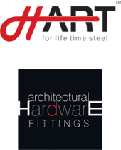

<div align="center">



# HART Architectural Hardware by Alfa Industries

**Modern Digital Product Showroom, Interactive Quotation Engine & Technical Dataset**  
*Manufactured in Rajkot, Gujarat, India • ISO 9001:2008 Certified*

[](https://github.com/bluenovatechin/Alfa-Industries/actions/workflows/deploy.yml)
[](https://bluenovatechin.github.io/Alfa-Industries/)
[](https://react.dev/)
[](https://vitejs.dev/)
[](https://bluenovatechin.github.io/Alfa-Industries/#quality)
[](#-materials--quality-standards)
[](#-license--credits)

<p align="center">
  <a href="https://bluenovatechin.github.io/Alfa-Industries/"><strong>Explore Live Website »</strong></a>
  <br />
  <a href="#-key-features">Key Features</a> •
  <a href="#-product-catalog">Product Catalog</a> •
  <a href="#-getting-started">Getting Started</a> •
  <a href="#-dataset--developer-api">Dataset & API</a> •
  <a href="#-contact--inquiries">Contact</a>
</p>

</div>

---

## 📌 Executive Summary

**Alfa Industries** is a premier Indian manufacturer specializing in corrosion-resistant, high-grade **AISI 316 and AISI 304 stainless steel architectural hardware fittings**, marketed under the flagship brand name **HART**. 

This repository houses the modernized web application, interactive product catalog, digital quotation system (RFQ), and a 100% complete technical dataset mirroring all 185 architectural products and 395 media assets from the original manufacturer records.

### 🌐 Live Production Deployment
The application is automatically built and deployed via GitHub Actions:  
👉 **[https://bluenovatechin.github.io/Alfa-Industries/](https://bluenovatechin.github.io/Alfa-Industries/)**

---

## ✨ Key Features

- **⚡ Blazing Fast Single Page Architecture**  
  Built with **React 18** and **Vite 6** for near-instant transitions, zero external layout dependencies, and sub-second load times.

- **🔍 Global Omnisearch (Keyboard Shortcut `/`)**  
  Press `/` anywhere on the site to trigger the instant search modal. Query across model numbers (e.g., `ASF-01`, `AMH-15`), product names, material grades, and specifications with live highlighted matches.

- **📋 Interactive Inquiry / RFQ Tray ("Quote Cart")**  
  Clients, architects, and contractors can add multiple hardware models to an inquiry drawer with persistent `localStorage` synchronization. Generates pre-formatted quotation requests directly dispatchable via **WhatsApp** or **Email** (`info@alfahardware.com`).

- **🔎 Deep Specification Modals**  
  Every product card opens into a comprehensive technical sheet displaying high-resolution photos, exact AISI stainless steel grades, available finishes (Glossy, Matt, Satin), glass thickness tolerances, and dimensions.

- **📥 Digital Downloads Center**  
  One-click access to 9 official PDF product catalogs and brochures directly bundled in the repository for both online reading and offline reference.

- **🏭 Complete In-House Infrastructure Showcase**  
  Detailed manufacturing breakdown highlighting Alfa Industries' in-house machinery (VMC, CNC, hydraulic bending machines, power presses, surface and round-pipe grinding, TIG welding).

- **📱 Industrial-Grade Responsive Design System**  
  Engineered with high-contrast architectural typography (**IBM Plex Sans**, **IBM Plex Mono**, and **Archivo**), mobile drawer navigation, smooth micro-interactions, and accessibility-first contrast.

- **🚀 Seamless GitHub Actions CI/CD**  
  Automated build, bundle optimization, and zero-downtime deployment to GitHub Pages upon every commit to `main`.

---

## 🗂️ Product Catalog (185 Products across 9 Categories)

All products are manufactured under rigorous **ISO 9001:2008** quality standards using virgin raw materials tested for physical and chemical parameters:

| # | Product Category | Items | Item Code Range | Brochure / Catalog PDF |
| :-: | :--- | :---: | :--- | :--- |
| **1** | **Spider Fittings** | **23** | `ASF-01` to `ASP-01` | [`spider-fittings.pdf`](assets/pdf/spider-fittings.pdf) |
| **2** | **Canopy Fittings** | **5** | `ACF-01` to `ACF-05` | [`canopy-fittings.pdf`](assets/pdf/canopy-fittings.pdf) |
| **3** | **Glass Door Sliding Folding Systems** | **23** | `AGSF-01` to `A-4` | [`glass-door-sliding-folding-system.pdf`](assets/pdf/glass-door-sliding-folding-system.pdf) |
| **4** | **Shower Glass Fittings & Sliding Handles** | **24** | `ASDH-01` to `A-R-04` | [`shower-glass-fittings.pdf`](assets/pdf/shower-glass-fittings.pdf) |
| **5** | **Patch Fittings** | **10** | `APF-01` to `APF-10` | [`patch-fittings.pdf`](assets/pdf/patch-fittings.pdf) |
| **6** | **Mortise Handles** | **53** | `AMH-01` to `AMC-04` | [`motise-handles.pdf`](assets/pdf/motise-handles.pdf) |
| **7** | **Glass Door Handles** | **21** | `APH-01` to `APH-21` | [`glass-door-handles.pdf`](assets/pdf/glass-door-handles.pdf) |
| **8** | **Glass Connectors** | **22** | `AGC-01` to `AGH-02` | [`glass-connectors.pdf`](assets/pdf/glass-connectors.pdf) |
| **9** | **Floor Spring & Door Closer** | **4** | `AFS-01`, `ADC-01`, `Top Pivot`, `Bottom Strip` | [`floor-spring-door-closer.pdf`](assets/pdf/floor-spring-door-closer.pdf) |
| 📊 | **TOTAL CATALOG SIZE** | **185** | *Complete Technical Coverage* | **9 Official PDFs (25.7 MB)** |

---

## 🛠️ Technology Stack

| Layer | Technology | Details |
| :--- | :--- | :--- |
| **Framework** | [React 18](https://react.dev/) | Client-side reactive UI components, hooks, and modals |
| **Build Tool & Bundler** | [Vite 6](https://vitejs.dev/) | Lightning fast HMR development server & Rollup production builds |
| **Icons** | [Lucide React](https://lucide.dev/) | Crisp, lightweight SVG iconography |
| **Typography** | Google Fonts | IBM Plex Sans (Content), IBM Plex Mono (Codes), Archivo (Headings) |
| **Styling** | Vanilla CSS3 | Custom design system with CSS tokens, fluid grid, and zero external CSS bloat |
| **Routing** | Custom Hash Router | GitHub Pages-compatible routing (`#products`, `#company`, `#quality`, etc.) |
| **Data Engine** | JSON & Universal JS | Full offline datasets (`alfa_hardware_data.json` & `.js`) |
| **CI/CD** | GitHub Actions | Automated deployment pipeline via `.github/workflows/deploy.yml` |

---

## 📂 Repository Directory Structure

```text
Alfa-Industries/
├── .github/
│   └── workflows/
│       └── deploy.yml              # Automated GitHub Pages CI/CD workflow
├── assets/                         # 395 offline media assets (~25.7 MB)
│   ├── images/                     # Logos, 10 hero sliders, feature highlights
│   ├── canopy-fittings/            # Canopy fitting photography
│   ├── floor-spring-and-door-closer/ # Floor spring & door closer photos
│   ├── glass-connectors/           # Glass connector hardware
│   ├── glass-door-handles/         # Architectural pull handle photography
│   ├── glass-door-sliding-folding-system/ # Sliding & folding track systems
│   ├── mortise-handles/            # 53 mortise lock & handle photographs
│   ├── patch-fittings/             # Frameless glass patch fitting images
│   ├── sliding-door-handles/       # Shower & sliding handle imagery
│   ├── spider-fittings/            # Point-fixed glass spider fittings
│   └── pdf/                        # 9 official product catalogs & brochures
├── src/
│   ├── components/                 # Reusable UI components
│   │   ├── CtaBand.jsx             # Action callout banner
│   │   ├── Footer.jsx              # Universal footer with sitemap & contact
│   │   ├── Navbar.jsx              # Navigation with search trigger & RFQ counter
│   │   ├── PageHeader.jsx          # Standardized breadcrumb & header block
│   │   ├── ProductCard.jsx         # Catalog item cards with quick-inquire
│   │   ├── ProductModal.jsx        # Detailed specification sheet modal
│   │   ├── QuoteDrawer.jsx         # Persistent RFQ inquiry cart drawer
│   │   └── SearchModal.jsx         # Omnisearch modal with live filtering
│   ├── data/
│   │   ├── alfaData.js             # Thin wrapper around master hardware data
│   │   └── catalog.js              # High-level query helpers, category filters & counts
│   ├── lib/
│   │   └── router.js               # Hash router with query parameter support
│   ├── pages/                      # Application route views
│   │   ├── CompanyPage.jsx         # About Us & Manufacturing Infrastructure
│   │   ├── ContactPage.jsx         # Interactive feedback & enquiry forms
│   │   ├── DownloadsPage.jsx       # Catalog download cards & links
│   │   ├── HomePage.jsx            # Hero carousel, featured categories, trust stats
│   │   ├── NotFoundPage.jsx        # 404 fallback page
│   │   ├── ProductsPage.jsx        # Filterable catalog grid with category tabs
│   │   └── QualityPage.jsx         # ISO 9001:2008 & Testing Methodology
│   ├── App.jsx                     # Root application container & global modals
│   ├── index.css                   # Custom architectural design system (~53 kB)
│   └── main.jsx                    # React 18 DOM mount point
├── public/                         # Static public assets
├── alfa_hardware_data.json         # 100% complete verbatim product dataset (~995 KB)
├── alfa_hardware_data.js           # Universal ESM/CommonJS/Browser data access API (~1.0 MB)
├── index.html                      # HTML5 entry with meta SEO & Open Graph tags
├── package.json                    # Project dependencies & scripts
├── vite.config.js                  # Vite configuration with GitHub Pages base path
└── README.md                       # Complete project & dataset documentation
```

---

## 🚀 Getting Started

### Prerequisites

Ensure you have the following installed on your machine:
- **Node.js**: `v18.0.0` or higher (Node 20+ recommended)
- **npm**: `v9.0.0` or higher (or `pnpm` / `yarn`)

### 1. Clone the Repository

```bash
git clone https://github.com/bluenovatechin/Alfa-Industries.git
cd Alfa-Industries
```

### 2. Install Dependencies

```bash
npm install
```

### 3. Launch Development Server

```bash
npm run dev
```

The application will start locally at **`http://localhost:3000/Alfa-Industries/`** (or the port specified in terminal).

### 4. Build for Production

```bash
npm run build
```

This compiles optimized, minified production assets into the `dist/` directory.

### 5. Preview Production Build Locally

```bash
npm run preview
```

---

## 📦 Dataset & Developer API

The repository provides dual-format access to the complete Alfa Hardware product dataset via **`alfa_hardware_data.json`** and **`alfa_hardware_data.js`**. You can consume it in any JavaScript or Node.js environment.

### 1. React / Next.js / Vite (ESM)

```javascript
import { alfaHardwareData, AlfaHardwareAPI } from './alfa_hardware_data.js';

// Retrieve company profile & infrastructure
const company = AlfaHardwareAPI.getCompanyInfo();
console.log(company.aboutUs.text);
console.log(company.infrastructure.text);

// Lookup a product by item code
const spiderFitting = AlfaHardwareAPI.getProductByCode('ASF-01');
console.log(spiderFitting.title);
console.log(spiderFitting.specifications.Material); // e.g. "AISI 316 / 304"
console.log(spiderFitting.images.fullLocal);
```

### 2. Node.js / Express (CommonJS)

```javascript
const { AlfaHardwareAPI } = require('./alfa_hardware_data.js');
// or load raw JSON
const data = require('./alfa_hardware_data.json');

const allSpiderFittings = AlfaHardwareAPI.getProductsByCategory('spider-fittings');
console.log(`Found ${allSpiderFittings.length} spider fittings.`);
```

### 3. Vanilla Browser Script Tag

```html
<script src="alfa_hardware_data.js"></script>
<script>
  window.addEventListener('DOMContentLoaded', () => {
    const mortiseHandle = window.AlfaHardwareAPI.getProductByCode('AMH-01');
    console.log(mortiseHandle.title, mortiseHandle.specifications);
  });
</script>
```

---

## 🚢 CI/CD & Deployment

This project uses **GitHub Actions** for zero-touch deployment to **GitHub Pages**.

- **Workflow File**: [`.github/workflows/deploy.yml`](.github/workflows/deploy.yml)
- **Trigger**: Every push or merge to the `main` branch, or manual trigger via `workflow_dispatch`.
- **Base URL**: Configured in [`vite.config.js`](vite.config.js) as:
  ```javascript
  export default defineConfig({
    base: '/Alfa-Industries/',
    // ...
  });
  ```

To deploy your own fork:
1. Fork or push this repository to GitHub.
2. Go to **Settings > Pages**.
3. Under **Build and deployment > Source**, select **GitHub Actions**.
4. Push a commit to `main`; the workflow will automatically build and publish the site.

---

## 🏭 Materials & Quality Standards

- **Steel Grades**: AISI 316 and AISI 304 marine-grade and architectural stainless steels.
- **Finishes Available**: PSS (Polished Stainless Steel / Glossy), SSS (Satin Stainless Steel / Matt), and Custom Electroplated Architectural finishes.
- **Testing**: Rigid metallurgical and mechanical testing covering tensile strength, load tolerances, corrosion resistance, and dimensional precision.
- **Quality Standard**: ISO 9001:2008 Certified manufacturing facility.

---

## 📞 Contact & Inquiries

**Alfa Industries** welcomes commercial inquiries, domestic dealership requests, architectural collaborations, and international exports.

| Detail | Information |
| :--- | :--- |
| **Company** | **ALFA INDUSTRIES** (Brand: **HART**) |
| **Factory Address** | Survey No. 257, Plot No. 1-A, Opp. Supreme Polymers,<br>B/h. Maruti Petrol Pump, Shapar (Veraval) – 360024,<br>Dist. Rajkot, Gujarat, India |
| **Contact Persons** | • **Mr. Haresh Patel**: `+91 98792 52904`<br>• **Mr. Bhavesh Patel**: `+91 99255 07880` |
| **Phone & Fax** | `+91 2827 253904` |
| **Email** | [info@alfahardware.com](mailto:info@alfahardware.com) |
| **Website** | [www.alfahardware.com](https://www.alfahardware.com/) |
| **Digital Showroom** | [bluenovatechin.github.io/Alfa-Industries](https://bluenovatechin.github.io/Alfa-Industries/) |

---

## 📄 License & Credits

- **Hardware Designs, Catalog & Media**: © Alfa Industries, Rajkot (Gujarat). All rights reserved.
- **Modern Web Application & Engineering**: Maintained by [BlueNova Tech](https://github.com/bluenovatechin).
- **Icons**: [Lucide](https://lucide.dev/) (ISC License).

<div align="center">
  <sub>Engineered with precision for architects, builders, and interior designers worldwide.</sub>
</div>